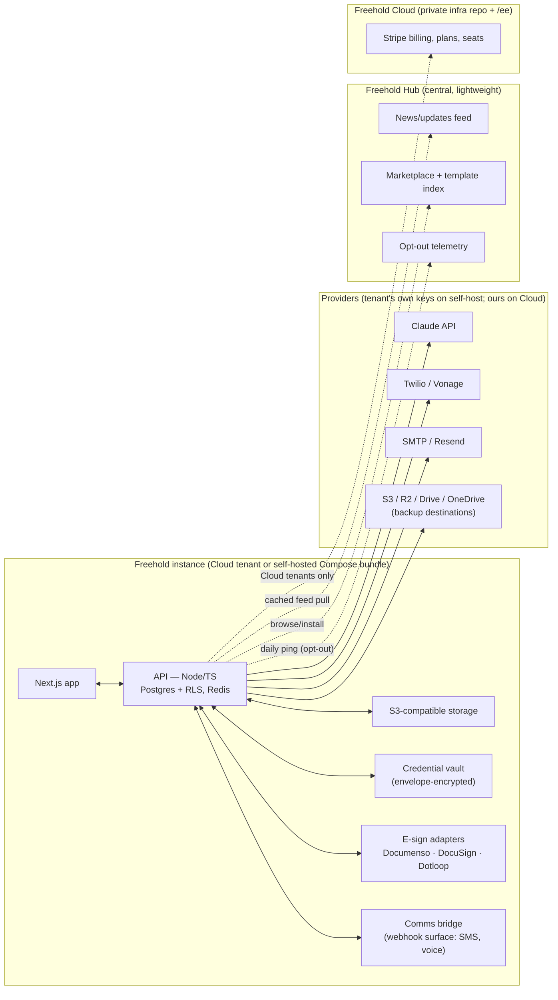

# Freehold — Build Plan v2

*Working name **Freehold** (fallback: FreeholdTC), chosen 2026-07-18 — no software/TC-space collision found; `freehold.app` and `freeholdtc.com` unregistered at time of check, not yet purchased. Supersedes the v1 "Keystone" plan. A styled copy lives at [`plan.html`](plan.html).*

An AI-enabled transaction management and CRM platform for real estate brokerages and transaction coordinators — one system of record for listings, contracts, contacts, and closings. **Fully open source (Apache-2.0), unlimited when self-hosted. Revenue comes from Freehold Cloud (the hosted version, the primary offering) plus services and a template/integration marketplace — not from license enforcement.**

**Stack at a glance:** Next.js · Node/TypeScript · PostgreSQL + Prisma (row-level tenancy) · Redis + BullMQ · S3-compatible storage · Claude API · Apache-2.0 core with a commercial `/ee` folder · Revenue = cloud hosting + services + marketplace.

## Contents

- [What changed from v1](#what-changed-from-v1)
- [Business model](#business-model)
- [System architecture](#system-architecture)
- [Tenancy model](#tenancy-model)
- [Core modules](#core-modules)
- [The AI wedge: contract extraction](#the-ai-wedge-contract-extraction)
- [Credential vault](#credential-vault)
- [Integrations & e-signature](#integrations--e-signature)
- [Template library & marketplace](#template-library--marketplace)
- [Backups, retention & compliance](#backups-retention--compliance)
- [Communications (SMS / voice)](#communications-sms--voice)
- [Build stages](#build-stages)
- [Repo layout](#repo-layout)
- [Pricing (proposed defaults)](#pricing-proposed-defaults)
- [Open decisions](#open-decisions)

## What changed from v1

Recorded so the reasoning isn't lost. Paul's decision 2026-07-18: *"I realize I really want to offer this as open source and provide the cloud hosting."*

| v1 (Keystone) | v2 (Freehold) | Why |
|---|---|---|
| Open-core with metered Gateway enforcing AI/voice capacity | **Fully open source; self-host is unlimited, bring-your-own API keys** | Enforcement machinery (trial clocks, license keys, quota gates) is dropped — cloud hosting is the honest monetization and the one every comparable OSS company earns most from |
| Closed plugin marketplace as second revenue layer | **Integration directory + TC template library** (content marketplace with revenue share) | Vendors and offerings churn constantly; integrations are the natural "plugin". Checklist packs authored by veteran TCs are a marketplace whose sellers aren't developers |
| Transaction-volume caps considered for self-host | **No caps anywhere on self-host.** Limits exist only as Cloud plan tiers | A cap in Apache-2.0 code is both technically and *legally* strippable, and draws "fake open source" blowback at launch |
| 3 closed companion repos (gateway, registry, plugins) | **One public monorepo with `/ee` commercial folder + one private infra repo** | Cal.com pattern; a fraction of the maintenance surface for a small team |
| Voice IVR as a core staged build | **Webhook "comms bridge" surface; voice ships later as an attachable service** (a pattern the maintainers have shipped before) | Paul already built the voice stack once; core just needs a clean attachment point |
| No hosted offering specified | **Freehold Cloud is the primary offering** | Non-technical TCs should never self-host; hosting is the main revenue line |

Kept from v1: the stack, shared-DB row-level tenancy, Documenso at arm's length (AGPL isolation), Stripe + Stripe Connect, staged sequential build, opt-out telemetry disclosed in the README.

## Business model

Four revenue lines, none of which require restricting the open-source version:

1. **Freehold Cloud** (primary). Managed hosting: sign up like any SaaS, no servers. Free tier: **up to 10 active transactions/month and 2 users**. Paid plans are per-seat monthly with usage-based AI fair-use included; seats and upgrades purchased directly in the admin panel. Hitting a free-tier limit never locks data: existing transactions stay readable and exportable; creating *new* ones requires upgrading.
2. **Services.** "We set it up for you" (managed self-host setup) and white-glove data migration from incumbent platforms.
3. **Marketplace.** Paid template/checklist packs with author revenue share; possibly paid premium integrations later. See [Template library & marketplace](#template-library--marketplace).
4. **Advertising / directory** (later). Curated directory of real-estate law firms and vendors; sponsored placement. Low build cost, real niche value — sequenced after launch.

The self-hosted version is genuinely unlimited and free forever. Conversion to Cloud is driven by convenience, not coercion: an **admin-homescreen news/updates panel** fed from a central feed carries release notes and Cloud promotions into every install (cached, fails silent, no tracking beyond the disclosed opt-out telemetry ping).

## System architecture



### Stack rationale

| Layer | Choice | Notes |
|---|---|---|
| Frontend + API | Next.js (App Router), Node/TS API | Runs on Vercel/Railway for Cloud **and** in a plain Docker container for self-host — no platform lock-in in core |
| Database | PostgreSQL + Prisma, `tenant_id` + Postgres Row-Level Security | Shared DB, revisit only for enterprise hard-isolation asks |
| Queue/jobs | Redis + BullMQ | Imports, document rendering, email sends, backup jobs |
| Object storage | **S3-compatible interface**; bundled default for self-host, S3/R2 on Cloud | MinIO's community edition was hollowed out in 2025 — treat storage as a contract, not a vendor; pick bundled default (SeaweedFS is Apache-2.0) at implementation |
| Email | SMTP abstraction; Resend adapter on Cloud | Resend is SaaS-only (not self-hostable), so self-host configures any SMTP |
| Auth | Self-host-friendly (email/password + OAuth), no third-party-SaaS dependency to log in | Rules out Clerk/Auth0-only paths |
| AI | Claude API (Sonnet for extraction/reasoning, Haiku for high-volume parsing) | Cloud: included with fair-use credits. Self-host: bring your own Anthropic key |
| E-signature | Adapter interface: Documenso (arm's-length service, AGPL-isolated) + DocuSign + Dotloop | Concurrent use per client — see [Integrations & e-signature](#integrations--e-signature) |
| SMS/voice | BYO Twilio or Vonage keys through the comms bridge | See [Communications](#communications-sms--voice) |
| Payments | Stripe (Cloud billing) + Stripe Connect Express (tenant invoices their clients) | TCs bill per transaction — invoicing their agents/brokerages is core product, not just plumbing |

### Distribution channels

1. **Freehold Cloud** — primary; nothing to install.
2. **Docker Compose bundle** — one file, one command, one machine: web + API + Postgres + Redis + storage + Documenso. The *only* supported self-host path at launch (no "make a Vercel account and a Railway account and wire them together").
3. **One-click templates** (Railway, Coolify, Elestio) — post-launch conveniences built on the same images.

## Tenancy model

Decided 2026-07-18 — this is a three-level model, and it reshapes the v1 schema:

- **Tenant** — the paying customer: a broker running their book, a title company, or a solo TC business. Root of row-level isolation, owner of billing.
- **Client** *(new first-class entity)* — who the tenant serves: an agent, a brokerage, a lender. Transactions belong to a client; credential-vault entries, e-sign provider preference, portal branding, and invoicing all attach at the client level. This is the entity v1 was missing.
- **User** — the tenant's staff (and client-scoped portal users), with roles: owner, admin, TC, assistant, client-viewer.

| Entity | Key fields | Notes |
|---|---|---|
| Tenant | id, name, plan_tier | Isolation root |
| Client | id, tenant_id, type (agent/brokerage/title/lender), branding, esign_provider_pref | The tenant's customer |
| User | id, tenant_id, client_id?, role, email | client_id set for portal-only users |
| Contact | id, tenant_id, owner_id, category, rating, touch_date | CRM record |
| Transaction | id, tenant_id, client_id, status, property_address, close_date, custom_fields | Central object |
| Task / ActionPlan | as v1 | Generated from templates; template packs come from the library |
| Document | id, transaction_id, storage_key, extraction_id?, signature_status | |
| ContractExtraction | id, document_id, fields[] (value, page_ref, confidence, confirmed_by) | The wedge — see below |
| Credential | id, tenant_id, client_id, system (MLS/lender portal/…), enc_blob, audit[] | See [Credential vault](#credential-vault) |
| BackupTarget | id, tenant_id, provider (gdrive/onedrive/s3/…), config | Client-owned destinations |
| Invoice / ConnectAccount | tenant_id, client_id, stripe ids | Tenant→client billing |

## Core modules

Everything in the feature-parity set (drawn from the leading legacy TC platforms) is core and open source — the boundary question from v1 is gone:

| Category | Module | Status |
|---|---|---|
| Transaction management (unlimited, custom fields, docs, tasks, merge-field email) | `transactions` | Core |
| CRM (categories, ratings, ownership, touch dates, mass email) | `crm` | Core |
| Dashboards (saved views, filters, custom columns) | `dashboards` | Core |
| Workflows / action plans (prebuilt + custom, role auto-assignment) | `workflows` | Core |
| Analytics & reporting (pipeline, individual/team, client-facing) | `reporting` | Core |
| Team management (roles, ownership) | `iam` | Core |
| Client portal (branded views, selective sharing) | `portal` | Core |
| Open REST API + webhooks + Zapier | `public-api` | Core |
| Importers framework + per-vendor importers | `importers` | Core |
| MLS adapter interface (RESO Web API) | `mls` | Core surface; per-MLS adapters land over time |
| Credential vault | `vault` | Core |
| Backup engine → client-owned storage | `backups` | Core |
| Audit trail + retention policies | `compliance` | Core |
| Contract extraction AI | `ai-extract` | Core code; needs an Anthropic key (yours on self-host, included on Cloud) |

First-run experience (decided, priority from start): seed data with a fake brokerage and transactions (one-click removable), an onboarding wizard on first boot, an admin **system health** page (self-host support becomes "send a screenshot of your health page"), and painless upgrades — automatic DB migrations on update plus an "update available" banner.

## The AI wedge: contract extraction

The single feature that makes someone switch (Paul: *"read a real estate contract accurately and get the key dates and figures into the system without guessing"*):

- Upload a purchase contract PDF → Claude extracts parties, property, price, deposits, and every deadline-bearing date (inspection, financing, appraisal, closing…).
- **No guessing, structurally:** every extracted field carries a page/snippet citation and a confidence level; a confirmation screen shows field ↔ source side-by-side; nothing enters the record until a human confirms. Low-confidence fields are flagged, never silently filled.
- Confirmed dates auto-populate the transaction and instantiate the action plan's deadline tasks.
- Same pipeline later powers amendment diffing ("what changed in this addendum?") and missing-document flags.

## Credential vault

TCs log into third-party systems (MLS, lender portals, e-sign accounts) *as their clients*. Storing those credentials safely is a real, underserved need — and core.

**Research result (2026-07):** open-source team password management exists and is mature — [Passbolt](https://www.passbolt.com) (AGPL, team-first per-resource sharing), [Vaultwarden](https://github.com/dani-garcia/vaultwarden) (AGPL, Bitwarden-compatible), [Psono](https://psono.com) (Apache-2.0, team/audit oriented). Decision: **build a native vault module in core** rather than embedding one of these — the workflow here is "credentials attached to a client record with role-gated reveal and an audit trail", which is a CRM feature, not a general password manager. Bitwarden-format import/export keeps us compatible with what TCs may already use; Psono's Apache-2.0 code is available to borrow from if needed.

Design:

- Envelope encryption: per-tenant data keys wrapping per-credential blobs; KMS-managed master key on Cloud, master-key env var on self-host. Credentials are never stored or logged in plaintext.
- Role-gated **reveal-on-click**, with every reveal written to the audit trail (who, when, which client's credential).
- ⚠️ **Compliance flag (needs Paul's sign-off):** most MLS terms of service prohibit credential sharing, and automated login with stored credentials (scraping) would compound the exposure. Launch posture: the vault *stores and audits* credentials with the client's consent — it does **not** log in anywhere automatically. Any future automation goes through official APIs (RESO) instead. The consent language and a disclaimer belong in the ToS.

## Integrations & e-signature

Integration targets (from direct experience with the leading legacy TC platforms):

| Integration | Tier | Notes |
|---|---|---|
| Gmail / Outlook (send + log correspondence) | Core | Table stakes |
| Stripe / Stripe Connect | Core | Platform + tenant→client invoicing |
| Zapier + open REST API + webhooks | Core | The universal escape hatch |
| Twenty CRM two-way sync | Core | Twenty is **AGPL-3.0** — integrate via its GraphQL/REST API, never embed its code in the Apache-2.0 core. Freehold keeps its own native CRM as system of record; sync is for tenants who live in Twenty |
| Dotloop, DocuSign | Core adapters | Both as e-sign/doc sources; see below |
| SkySlope, Follow Up Boss | Adapter, post-launch | Import first, sync later |
| MLS (per-MLS RESO adapters) | Core surface, adapters over time | |
| Podium / MessageDesk / Avochato / Aircall | Guidance + webhook recipes first | Native adapters only if demand shows |

**E-signature: concurrent adapters.** Different client brokerages mandate different systems, so provider choice is **per client, not per tenant**: Documenso (open source, bundled at arm's length — AGPL isolated behind its API), DocuSign, and Dotloop adapters behind one envelope interface. A tenant can run one client's closings through Dotloop and another's through Documenso simultaneously. Envelope status, signed PDFs, and audit trails land identically on the transaction regardless of provider.

**Importers.** One framework, many sources: generic CSV templates from day one, then per-vendor importers (the major legacy TC platforms) built incrementally. The sales line: *"if your system can export, we can import it."* White-glove migration offered as a paid service.

## Template library & marketplace

The marketplace's sellers are **TCs, not developers** — this is the v2 reframe and likely a bigger asset than the software plugins v1 planned:

- Action-plan/checklist packs: "Texas residential buy-side, 74 tasks", "Florida condo listing-side", authored by veteran TCs. Free packs seed the library; paid packs carry an author **revenue share** (default 70/30 author/platform — confirm).
- Distribution through the Hub's marketplace index; one-click install into any instance (Cloud or self-hosted).
- Quality: launch curated (hand-reviewed packs), open submissions later. State-specific accuracy matters here — reviews and versioning from day one.
- The same rail later carries integration listings and the law-firm/vendor directory with sponsored placement.

## Backups, retention & compliance

Decided as a headline core feature, not a Stage-10 afterthought:

- **Client-owned backups:** nightly encrypted export (DB + documents) pushed to storage the *tenant* controls — Google Drive, OneDrive, S3, Dropbox. Freehold Cloud is never the only copy of a brokerage's records. Restore tooling included and tested.
- **Retention policies:** states require brokers to keep complete transaction files for 3–7 years; per-tenant retention windows with legal-hold override.
- **Tamper-evident audit trail:** every material change (dates, money, documents, credential reveals) is append-only logged. This is a selling point in this niche — brokerages get audited.

## Communications (SMS / voice)

- **SMS:** tenants bring their own Twilio or Vonage keys (both supported). Freehold ships the workflows (task reminders, reply-"done"-to-close, status notifications), compliance helpers (opt-in/opt-out handling, quiet hours, A2P 10DLC registration guidance), a per-tenant **public compliance one-pager URL** (doubles as light marketing), and an in-app disclaimer that texting clients requires their consent. Because keys are tenant-owned, A2P/TCPA registration and liability sit with the tenant — Freehold provides rails and guidance, not carriage.
- **Voice:** not core at launch. The **comms bridge** exposes a documented webhook surface (post a structured transaction-update event with auth); a voice-agent service (Deepgram + ElevenLabs + Claude) attaches to it as a separate deployable. Paul has built this stack before; it lands as an attachable add-on once the bridge exists.

## Build stages

Sequential; each stage is deployed and demoable before the next. Assumes a small team; ~9–10 months to GA.

### Stage 00 — Foundations *(~2 wk)*
Monorepo + CI; auth (email/password + OAuth); three-level tenancy (tenant → client → user) with RLS; Docker Compose dev/self-host bundle from day one; `/ee` folder + commercial license header; **CLA Assistant configured before the repo goes public** (Apache ICLA-style template — Paul's explicit reminder); health page skeleton.
**Exit:** signup → empty dashboard on Compose and on a dev cloud deploy.

### Stage 01 — Core transaction management + CRM *(~5 wk)* ✅ *core shipped 2026-07-18*
Transactions (custom fields, unlimited), contacts, clients, dashboards/saved views, action plans + task templates with role auto-assignment, merge-field email templates (SMTP abstraction), seed data + onboarding wizard.
**Exit:** a TC runs one real transaction end-to-end. *Verified: transaction → parties → applied action plan with computed deadlines → task completion → pipeline dashboard; RLS tenant isolation proven live (app connects as non-superuser role). Deferred within stage: merge-field email templates/SMTP sending, saved views, role-based auto-assignment (template field exists; tasks assign to the applying user).*

### Stage 02 — Contract extraction (the wedge) *(~3 wk)* ✅ *shipped 2026-07-18*
Upload → Claude extraction → citation/confidence confirmation screen → dates instantiate deadline tasks. BYO Anthropic key path working.
**Exit:** a real signed contract produces correct, page-cited dates on a transaction with zero unconfirmed fields. **✅ Exit verified live 2026-07-18: sample contract extracted 20/20 fields correct** — all page-cited, explicit dates high-confidence, computed dates (e.g. "ten days of the Effective Date") correctly calendar-computed and marked medium; selective apply produced 7 dated tasks + party custom fields. Known nits: prompt should request 2-letter state abbreviations; duplicate party roles collide on one custom-field key. *Built: PDF upload (Postgres bytes — interim until Stage 03 storage), structured-outputs extraction (`claude-opus-4-8` default, `FREEHOLD_AI_MODEL` override), field-by-field review with page cites/quotes/confidence (low-confidence unchecked by default), apply → columns/dated tasks/custom fields, graceful no-key failure state. Sample contract at `apps/web/public/sample-contract.pdf`. Interim choices tracked: synchronous extraction call (BullMQ job later), bytes-in-Postgres (S3 in Stage 03).*

### Stage 03 — Documents + e-signature adapters *(~4 wk)* ✅ *core shipped 2026-07-18*
S3-abstraction storage + presigned flows; document templates + merge-to-PDF; envelope interface with Documenso (bundled, arm's-length) and DocuSign adapters; Dotloop adapter next; per-client provider preference.
**Exit:** two clients of one tenant sign through two different providers. **✅ Exit verified live 2026-07-18: the same document completed through two providers (Documenso + Manual).** *Built: storage abstraction (S3 driver verified live against MinIO with auto bucket creation; Postgres-bytes zero-config default; MinIO in the compose bundle), merge-field templates → PDF (verified), envelope layer with per-client provider preference. **Documenso adapter live-verified end-to-end** against a self-hosted instance (docker-compose.documenso.yml + db/documenso/gen-cert.sh): rewritten from the deprecated v1 API (which requires S3 on the Documenso side) to the v2 multipart API, with auto-placed signature fields (v2 refuses to distribute signers without fields); real signing email → recipient signed → status polled back COMPLETED. DocuSign adapter still config-gated, never live-tested. Dotloop deferred.*

### Stage 04 — Portals, roles, credential vault *(~4 wk)*
Branded client/buyer/seller portals with selective sharing; full RBAC; credential vault with envelope encryption, reveal audit, Bitwarden-format import/export.
**Exit:** a client views their closing via portal link; a TC retrieves a stored MLS credential with the reveal audited.

### Stage 05 — Freehold Cloud + billing *(~4 wk)*
Multi-tenant cloud deployment, signup, Stripe subscriptions; free tier (10 active transactions/mo, 2 users) with upgrade-in-admin seat purchase; graceful at-limit behavior (read/export always; new-transaction creation gated). Hub v1: news feed + opt-out telemetry.
**Exit:** a stranger can sign up, use the free tier, and upgrade with a card.

### Stage 06 — Launch *(~3 wk, its own deliverable — decided)*
Public demo instance with seeded brokerage; docs site + separate self-hosting guide site; honest Cloud-vs-self-host comparison page; README/screenshots as launch assets; Show HN / Product Hunt / r/selfhosted launch plan executed.
**Exit:** repo public, demo live, first outside signups.

### Stage 07 — Importers + integrations round 1 *(~4 wk)*
Import framework + CSV templates; first vendor importers (major legacy-platform exports); Gmail/Outlook send+log; public API + webhooks + Zapier; Twenty CRM two-way sync; Stripe Connect tenant→client invoicing.
**Exit:** a real book of business imported from a competitor export; a tenant invoices a client and gets paid.

### Stage 08 — Template library *(~3 wk)*
Marketplace index on the Hub; pack format (versioned, state-tagged); one-click install; curated launch set; paid packs + author revenue share via Stripe Connect.
**Exit:** a veteran TC's paid checklist pack sells and installs on a stranger's instance.

### Stage 09 — Comms round *(~3 wk)*
BYO Twilio/Vonage SMS with compliance helpers + public compliance page; reply-to-close task flow; comms-bridge webhook surface documented; voice-agent add-on attaches as the reference add-on.
**Exit:** an SMS "done" closes a task; a phoned-in update lands as a structured event via the bridge.

### Stage 10 — Hardening + GA *(~4 wk)*
Backup engine → client-owned destinations with restore drills; retention policies + audit trail completion; security review (third-party pen test when budget allows — see [Open decisions](#open-decisions)); load testing; MLS adapter #1 against a RESO sandbox.
**Exit:** GA — a brokerage can trust it with real contracts and PII.

## Repo layout

**One public monorepo + one private infra repo** (collapsed from v1's four):

```
freehold/                        (public, Apache-2.0 + /ee)
├── apps/
│   ├── web/                    Next.js frontend
│   └── api/                    Node/TS API
├── packages/
│   ├── db/                     Prisma schema + migrations
│   ├── ui/                     shared components
│   ├── workflows/              action plan engine
│   ├── importers/              import framework + vendor importers
│   ├── integrations/           esign/email/SMS/CRM adapter interfaces + open adapters
│   └── vault/                  credential vault (crypto + audit)
├── ee/                         commercial license — Cloud billing, plan gating
├── services/
│   ├── esign-bridge/           Documenso API wrapper (Documenso runs as its own service)
│   └── comms-bridge/           webhook surface for SMS/voice attach
├── docs/
└── LICENSE                     Apache-2.0 (root); ee/LICENSE commercial

freehold-infra/                  (private)
├── cloud/                      Cloud deploy, ops, runbooks
└── hub/                        news feed, marketplace index, telemetry
```

## Pricing (proposed defaults)

All numbers are proposals to confirm before Stage 05 — calibrated against the legacy platforms (roughly $32/user/mo at the low end to $99+/mo):

| Plan | Price | Includes |
|---|---|---|
| Self-hosted | Free forever | Everything, unlimited, BYO keys |
| Cloud Free | $0 | 2 users, 10 active transactions/mo, AI trial credits |
| Cloud Pro | ~$29/user/mo | Unlimited transactions, AI fair-use included, all integrations |
| Cloud Business | ~$59/user/mo | Priority support, advanced reporting, sub-billing (Connect) |
| Setup service | one-time fee | "We set it up for you" self-host install |
| Migration service | quoted | White-glove import from any incumbent |

Budget note: development + initial rollout runs on ~$100/mo (hobby-tier hosting + provider testing). Cloud infrastructure cost scales with tenants and must be repriced into the tiers at first real usage — flagged, not a blocker.

## Open decisions

| Decision | Default in this plan | Status |
|---|---|---|
| Name | Freehold (FreeholdTC fallback) | Checked clean in software/TC space; **domains not yet purchased** — buy before public repo |
| Cloud free-tier at-limit behavior | New-transaction creation gated; read/export always free | Default — confirm |
| Pricing numbers | Table above | Proposed — confirm before Stage 05 |
| Template revenue share | 70/30 author/platform | Proposed — confirm before Stage 08 |
| Self-host bundled storage | SeaweedFS (Apache-2.0) over MinIO | Default — decide at Stage 03 |
| Cloud hosting platform | Start Vercel + Railway hobby tiers; consolidate later if cost demands | Default — revisit at Stage 05 |
| Vault automation (auto-login with stored creds) | **Not at launch** — MLS ToS risk; official APIs only | Decided; revisit only with legal review |
| Pen test | Deferred until revenue covers it; structured self-review + disclosure policy at GA | Default given $100/mo budget |
| CLA | CLA Assistant + Apache ICLA-style template, live before repo goes public | Decided — do not forget (tracked) |
| Telemetry | Anonymized daily ping, README-disclosed, env-var opt-out | Confirmed |
